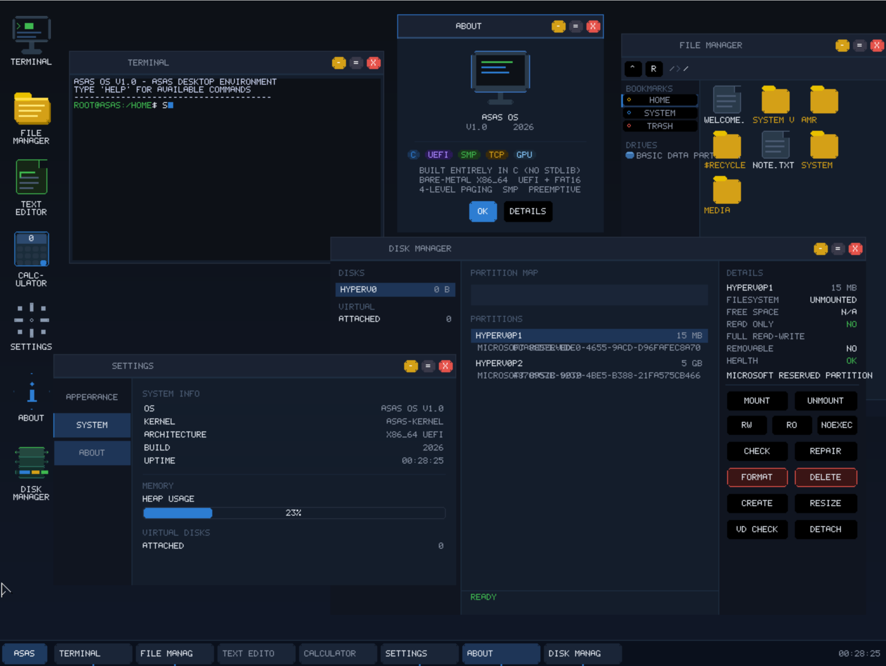

# Asas OS 1.0

**Asas OS** is a small x86_64 operating system built from scratch with C, C++,
and Assembly. The name "Asas" means "foundation": this project is an open
workshop for people who want to understand, build, and improve the layers that
make an operating system feel alive, from UEFI boot to a custom desktop,
filesystems, storage drivers, and developer tooling.

Version **1.0** is the first public milestone that is exciting enough to invite
people in. It boots through UEFI, runs a custom kernel and GUI, exposes an
interactive shell, and has a stable Hyper-V Generation 2 live environment with
working keyboard, mouse, disk discovery, and a growing disk-management stack.

> Asas OS is an experimental hobby/research operating system. It is not intended
> to replace a production desktop/server OS.

Public repository target:

```text
https://github.com/amrflame/asas-os
```



## Why Contribute?

Operating-system development is usually hidden behind huge codebases. Asas OS
tries to keep the door open: the code is small enough to study, but real enough
to teach serious systems work. A contribution here can touch the boot path, a
filesystem, a block device, the GUI, a shell command, documentation, tests, or a
new hardware experiment.

Good contributions are welcome at every level:

- first-time contributors can improve docs, screenshots, command help, tests,
  and small GUI details;
- systems contributors can work on storage, VFS, filesystems, scheduling,
  memory, networking, and hardware paths;
- testers can boot new VM configurations, try real disk images, report exact
  logs, and help turn experiments into reliable behavior.

The project values careful engineering: small pull requests, clear test notes,
and safe failure modes matter more than dramatic rewrites.

## Highlights

- UEFI x86_64 bootloader and standalone kernel image.
- Framebuffer console and custom GUI desktop (`AsasGUI`).
- Interactive terminal and file-manager window.
- Hyper-V Generation 2 live ISO support.
- Hyper-V VMBus keyboard and synthetic HID mouse input.
- RAM-backed boot filesystem populated from the ISO.
- Physical frame allocator, paging, high-half mappings, NX support, and kernel heap.
- GDT/IDT setup, interrupt handling, APIC timer, and SMP discovery/startup.
- Cooperative/preemptive scheduler foundations, processes, IPC, syscalls, and PE64 user-program loading.
- VFS with FAT16/FAT32 plus transactional NTFS and exFAT read/write.
- NTFS includes multi-extent and LZNT1 reads, create/delete/rename/move,
  extension records, and multi-leaf directory index mutation.
- exFAT includes boot/checksum validation, Allocation Bitmap/FAT mutation,
  Unicode lookup, directory growth, create/write/delete/rename/move, rollback,
  remount verification, and automatic VFS mounting.
- Mount Manager with stable slots, busy-handle protection, read-only/no-exec
  policies, UUID/label lookup, and `/system`, `/data`, `/media/usbN`,
  `/media/diskN`, and `/media/cdromN` namespaces.
- QEMU-verified VirtIO block/network, xHCI USB keyboard/mouse/storage, AHCI, and NVMe paths.
- Basic networking stack pieces: Ethernet, ARP, IPv4, ICMP, DHCP, DNS, TCP/HTTP probes.
- Shell commands for files, processes, network tests, power probes, and system info.

## Current Stable Target

The stable 1.0 public target is:

```text
build/asas-os-hyperv-gen2.iso
```

This ISO is intended for **Hyper-V Generation 2** with UEFI firmware and Secure
Boot disabled. It boots into AsasGUI and runs from the ISO/RAM-backed live
environment.

## Screens And User Experience

AsasGUI currently provides:

- a desktop drawn directly to the framebuffer;
- a terminal window connected to the kernel shell;
- a file-manager window backed by the VFS;
- draggable/minimizable windows and a taskbar;
- mouse cursor rendering and click/drag handling;
- a small bitmap font for printable ASCII.

The shell starts in the live environment and supports `help`, file browsing,
basic file operations, process commands, simple network probes, and power/device
status commands.

## Repository Layout

```text
.
|-- build.ps1                  # Main Windows/MSVC build script
|-- include/                   # Kernel, boot, driver, VFS, GUI, and SDK headers
|-- src/
|   |-- boot/                  # UEFI bootloader
|   |-- kernel/                # Kernel, memory, drivers, GUI, VFS, shell
|   `-- user/                  # User-mode library and demo programs
|-- tests/                     # Boot image and QEMU automation
|-- tools/                     # Image, ISO, VHDX, and install helpers
|-- HARDWARE_COMPATIBILITY.md  # Current hardware/support notes
|-- DISK_MANAGEMENT_PLAN_AR.md # Arabic disk-management roadmap/progress tracker
|-- OS_DEVELOPMENT_PLAN_AR.md  # Original Arabic roadmap/progress tracker
|-- CONTRIBUTING.md            # Contribution guide
|-- SECURITY.md                # Security reporting policy
|-- ROADMAP.md                 # Public roadmap summary
`-- LICENSE                    # GNU GPL v3.0 only
```

## Build Requirements

The current build flow is Windows-first.

Required:

- Windows 10/11
- PowerShell
- Visual Studio 2022 C++ toolchain or Build Tools
- NASM, expected by `build.ps1` at:

```text
..\tools\nasm-2.16.03\nasm.exe
```

Optional but recommended:

- QEMU for automated boot tests
- Hyper-V for testing the Generation 2 ISO

## Build

From the repository root:

```powershell
powershell.exe -NoProfile -ExecutionPolicy Bypass -File .\build.ps1
```

Clean rebuild:

```powershell
powershell.exe -NoProfile -ExecutionPolicy Bypass -File .\build.ps1 -Clean
```

The build creates:

```text
build/EFI/BOOT/BOOTX64.EFI
build/ASAS/KERNEL.EFI
build/ASAS/APBOOT.BIN
build/sdk/HELLO.EXE
build/asas-os.img
build/asas-data.img
```

To clone the public repository after it is published:

```powershell
git clone https://github.com/amrflame/asas-os.git
cd asas-os
```

## Create The Hyper-V Gen2 ISO

```powershell
powershell.exe -NoProfile -ExecutionPolicy Bypass -File .\tools\New-AsasIso.ps1 -Build -Output .\build\asas-os-hyperv-gen2.iso
```

## Boot In Hyper-V

Recommended VM settings:

- Generation: **Generation 2**
- Firmware: UEFI
- Secure Boot: **Disabled**
- Memory: 512 MB or more
- Processor: 1 or more virtual CPUs
- DVD Drive: attach `build\asas-os-hyperv-gen2.iso`

Start the VM. The expected result is the AsasGUI desktop with a terminal and
file-manager window. Keyboard and mouse input should work through Hyper-V's
synthetic input devices.

## QEMU Testing

Run the boot image test:

```powershell
powershell.exe -NoProfile -ExecutionPolicy Bypass -File .\tests\Run-QemuBootTest.ps1
```

Run the full build plus test flow:

```powershell
powershell.exe -NoProfile -ExecutionPolicy Bypass -File .\tests\Run-All.ps1
```

The QEMU test path verifies boot, serial logging, memory and process checks,
filesystem operations, GUI initialization, selected device drivers, and network
probes.

## Boot Flow

```text
UEFI firmware
    |
    v
EFI/BOOT/BOOTX64.EFI
    |
    | loads BootInfo, AP trampoline, RAM files, and kernel image
    v
ASAS/KERNEL.EFI
    |
    | exits UEFI boot services
    v
Asas kernel
    |
    | initializes memory, CPU, devices, VFS, shell, GUI
    v
AsasGUI live desktop
```

## Shell Commands

Run `help` inside Asas OS to show the current command list. The help output is
formatted as:

```text
command | description | params | example
```

Current commands include:

| Command | Description | Parameters | Example |
|---|---|---|---|
| `help` | Show command help | none | `help` |
| `pwd` | Show current directory | none | `pwd` |
| `ls` | List files/directories | `[path]` | `ls /ASAS` |
| `cat` | Print file content | `path` | `cat /DISK.TXT` |
| `cd` | Change directory | `path` | `cd /ASAS` |
| `touch` | Create a file | `path` | `touch /A.TXT` |
| `write` | Write text to a file | `path text` | `write /A.TXT hello` |
| `rm` | Delete a file | `path` | `rm /A.TXT` |
| `mkdir` | Create a directory | `path` | `mkdir /WORK` |
| `rmdir` | Delete a directory | `path` | `rmdir /WORK` |
| `cp` | Copy a file | `src dst` | `cp /A.TXT /B.TXT` |
| `mv` | Move/rename a file | `src dst` | `mv /A.TXT /B.TXT` |
| `ps` | Show process information | none | `ps` |
| `kill` | Stop a process | `pid` | `kill 2` |
| `whoami` | Show current user | none | `whoami` |
| `permissions` | Show current permission bits | none | `permissions` |
| `ping` | Send an ICMP test | `ipv4` | `ping 10.0.2.2` |
| `wget` | HTTP GET probe | `host` | `wget example.com` |
| `http-server` | Serve one HTTP response | none | `http-server` |
| `power` | Show power capability status | none | `power` |
| `shutdown` | ACPI shutdown | none | `shutdown` |
| `reboot` | ACPI reboot | none | `reboot` |
| `sleep` | ACPI sleep attempt | none | `sleep` |
| `battery` | Battery namespace/status probe | none | `battery` |
| `beep` | PC speaker beep | none | `beep` |
| `touchpad` | Touchpad namespace probe | none | `touchpad` |
| `wifi` | Wi-Fi PCI class probe | none | `wifi` |
| `export` | Set environment variable | `KEY=VALUE` | `export A=1` |
| `env` | List environment variables | none | `env` |
| `grep` | Filter piped text | `pattern` | `cat /X.TXT | grep hi` |
| `wc` | Count piped input | none | `cat /X.TXT | wc` |

## Architecture Overview

### Bootloader

The bootloader is a UEFI application located at `EFI/BOOT/BOOTX64.EFI`. It loads:

- the kernel image at `ASAS/KERNEL.EFI`;
- boot metadata (`BootInfo`);
- the AP trampoline used by SMP startup;
- selected RAM-backed files used by the live environment.

### Kernel

The kernel initializes:

- framebuffer output;
- physical memory and paging;
- heap allocation;
- CPU structures and interrupts;
- APIC and SMP basics;
- PCI discovery;
- storage, input, network, power, and laptop probes;
- VFS and shell;
- AsasGUI.

### User Mode

Asas OS includes a small user-mode SDK and demo programs. User programs are
linked as PE64 binaries and loaded by the kernel's PE loader. Current user-mode
support is intentionally small and focused on proving syscalls, address-space
separation, and library foundations.

### GUI

AsasGUI is a kernel-side GUI environment with a simple window manager. It is not
a full desktop environment yet, but it is enough to interact with the shell and
inspect the live filesystem through the file-manager window.

## Device And Platform Support

### Stable In Asas OS 1.0

- Hyper-V Generation 2 UEFI boot from ISO
- Hyper-V synthetic keyboard
- Hyper-V synthetic HID mouse
- Hyper-V RAM/live boot mode
- QEMU UEFI test environment
- QEMU xHCI keyboard/mouse/storage path
- QEMU VirtIO block/network path
- QEMU AHCI and NVMe sector-read paths

### Experimental Or Limited

- Hyper-V VHD/VHDX storage read/write is not the main 1.0 boot path.
- Physical laptop/desktop validation is pending and hardware-specific.
- Wi-Fi, battery, and touchpad are currently probes, not full production drivers.
- HDA audio is not implemented; the current audio path is PC speaker-oriented.
- TCP is intentionally minimal and not a general-purpose networking stack.
- The security model is educational and incomplete compared with production OSes.

See `HARDWARE_COMPATIBILITY.md` for the tracked compatibility matrix.

## Known Limitations

- The stable Hyper-V release runs as a live ISO/RAM environment.
- Persistent disk writes on Hyper-V VHD/VHDX are still under development.
- The GUI is intentionally simple and kernel-side.
- Filesystem support is functional but not a replacement for mature desktop OS filesystems.
- The project currently targets MSVC/Windows build tooling.
- No Secure Boot signing is provided.

## Version 1.0 Definition

`asas-os-1.0` means:

- the OS boots reliably in Hyper-V Generation 2 from the public ISO;
- AsasGUI starts automatically;
- keyboard and mouse input work;
- the shell and file-manager window are usable;
- the live filesystem is available from RAM/ISO;
- the QEMU automated checks still build and validate the core image.

## Roadmap After 1.0

Likely next areas:

- persistent Hyper-V VHD/VHDX storage;
- cleaner release packaging and screenshots;
- expanded hardware validation;
- deeper HID parsing based on report descriptors;
- improved GUI widgets and applications;
- stronger process lifecycle cleanup;
- expanded TCP/network support;
- real audio drivers;
- authentication-backed users and stronger security boundaries.

## Contributing

This is an early operating-system project. Contributions should stay focused and
small. Please read `CONTRIBUTING.md` before opening a pull request.

- keep changes freestanding-friendly;
- avoid standard-library/runtime assumptions inside kernel code;
- prefer simple C interfaces across kernel subsystems;
- include test notes for QEMU or Hyper-V when changing boot/device paths;
- do not remove existing hardware fallback paths unless replacing them with a verified path.

Arabic contribution notes are available in `CONTRIBUTING_AR.md`.

For security-sensitive reports, read `SECURITY.md`. Arabic security notes are in
`SECURITY_AR.md`.

If you are not sure where to start, look for issues labeled `good first issue`,
`help wanted`, `docs`, `tests`, `gui`, `filesystem`, or `storage`. You can also
open a short discussion with the area you want to explore, and maintainers can
help shape it into a safe first patch.

## License

Asas OS is licensed under the GNU General Public License v3.0 only. See
`LICENSE` for the full license text.

By contributing to this repository, you agree that your contribution is licensed
under the same license.
